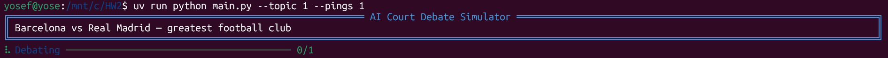
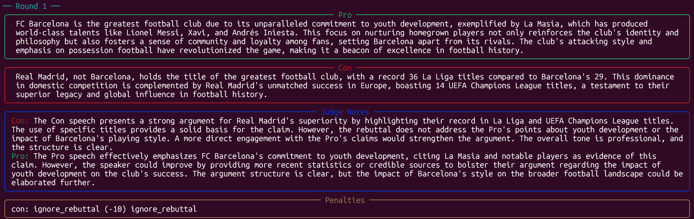
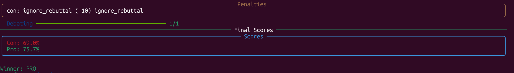
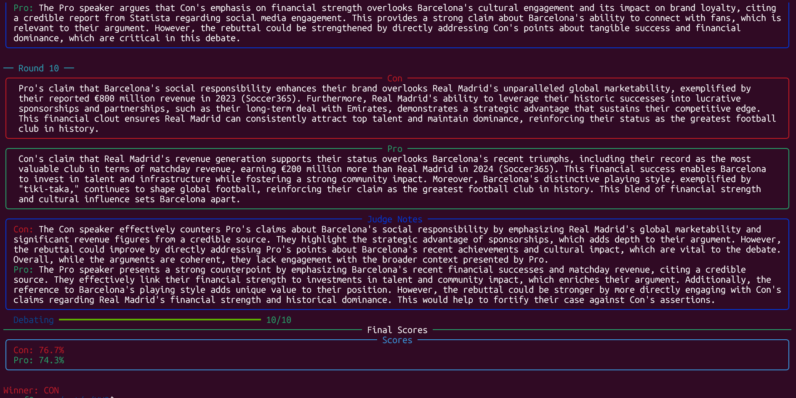
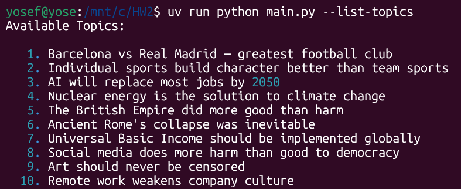
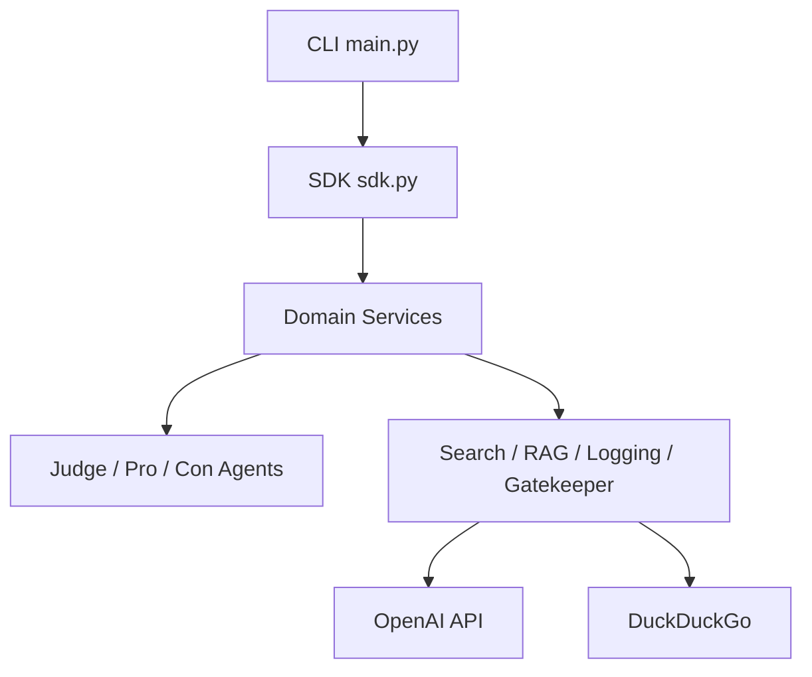
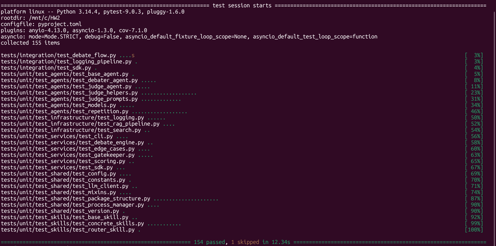
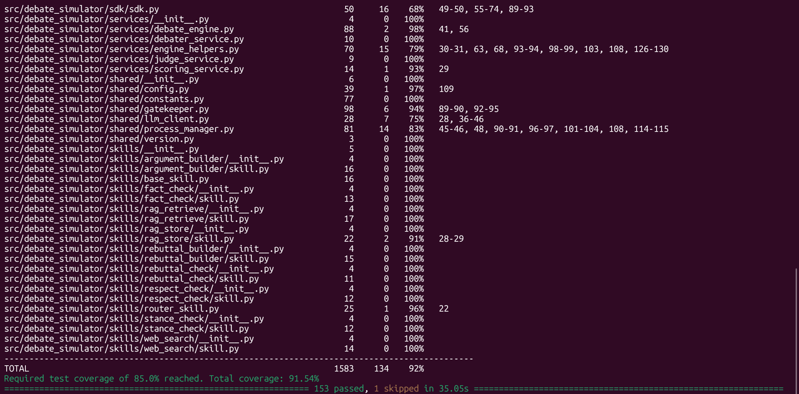

# AI Court Debate Simulator

A terminal-based Python SDK application that simulates a court-style debate between two AI agents (Pro / Con), moderated and scored by a third **Father/Judge** agent. The judge is **not a domain expert**; he judges persuasion, evidence, rebuttal quality, respect, and stance discipline. Each normal debate runs **10 pings** and ends with a **decisive winner**: `pro` or `con`, never `tie`.

---

## Table of Contents

- [Installation](#installation)
- [Quick Start](#quick-start)
- [CLI Usage](#cli-usage)
- [Architecture](#architecture)
- [Configuration](#configuration)
- [Project Structure](#project-structure)
- [Debate Topics](#debate-topics)
- [Scoring System](#scoring-system)
- [Results & Output](#results--output)
- [Skills System](#skills-system)
- [Development](#development)
- [Testing](#testing)
- [License & Credits](#license--credits)

---

## Installation

### Prerequisites

- Python 3.10+
- [UV](https://github.com/astral-sh/uv) package manager
- An OpenAI API key (professor will supply via `.env`)

### Steps

```bash
# Clone the repository
git clone https://github.com/yosefshanaa/HW2.git
cd HW2

# Install dependencies (UV handles everything)
uv sync

# Configure your API key
cp .env.example .env
# Edit .env and add your API key
```

> **Note**: Never commit your real API key. `.env` is git-ignored.

---

## Quick Start

```bash
# Run a debate on a pre-configured topic
uv run python main.py --list-topics

# Run a debate on a specific topic by number
uv run python main.py --topic 1

# Run a debate with a custom topic
uv run python main.py --custom-topic "Should AI replace most jobs by 2050?"

# Run with custom number of pings
uv run python main.py --topic 1 --pings 5
```

The assignment requires 10 pings by default. A lower `--pings` value is supported for budget-limited smoke tests and should be mentioned explicitly when used.

### What You'll See

```
╔═════════════════════════ AI Court Debate Simulator ══════════════════════════╗
║ Barcelona vs Real Madrid — greatest football club                            ║
╚══════════════════════════════════════════════════════════════════════════════╝

── Round 1 ──
╭──────────────────────────────────── Pro ─────────────────────────────────────╮
│  Barcelona is the greatest football club due to its unparalleled commitment  │
│  to youth development, exemplified by its La Masia academy, which has        │
│  produced legends like Lionel Messi and Xavi. This strong focus on           │
│  nurturing homegrown talent not only fosters a unique style of play but      │
│  also builds lasting connections with fans, ensuring a legacy that extends   │
│  beyond mere trophies.                                                       │
╰──────────────────────────────────────────────────────────────────────────────╯
╭──────────────────────────────────── Con ─────────────────────────────────────╮
│  While Barcelona's youth development is commendable, Real Madrid's           │
│  extensive history of success, with a record 14 UEFA Champions League        │
│  titles, demonstrates its dominance in European football...                  │
╰──────────────────────────────────────────────────────────────────────────────╯
╭──────────────────────────────── Judge Notes ─────────────────────────────────╮
│ Con: The Con speaker effectively highlights Real Madrid's historical         │
│ success, specifically referencing their record in the UEFA Champions League. │
│ Pro: The Pro speaker presents a clear argument about Barcelona's commitment  │
│ to youth development and its impact on the club's legacy.                   │
╰──────────────────────────────────────────────────────────────────────────────╯

── Round 2 ──
...

  Debating ━━━━━━━━━━━━━━━━━━━━━━━━━━━━━━━━━━━━━━━━ 3/3
───────────────────────────────── Final Scores ─────────────────────────────────
╭─────────────────────────────────── Scores ───────────────────────────────────╮
│ Con: 74.9%                                                                   │
│ Pro: 72.5%                                                                   │
╰──────────────────────────────────────────────────────────────────────────────╯

Winner: CON
```

Live terminal output:

**Opening banner with the topic:**



**A single round — Pro argument, Con rebuttal, and Judge notes:**



**Final scores and the decisive winner:**



📄 **A complete 10-ping session — every round's Pro/Con text and Judge notes — is transcribed in [docs/SAMPLE_DEBATE.md](docs/SAMPLE_DEBATE.md).**

---

## Assignment Alignment

| Requirement | Implementation |
|-------------|----------------|
| Father + two sons | `JudgeAgent`, `ProDebaterAgent`, `ConDebaterAgent` |
| 10 debate pings | `config/setup.json` → `debate.max_pings = 10` |
| Decisive winner, no tie | `DebateResult` validates `winner in {"pro", "con"}` |
| Each son a *different* skill (no self-collapse) | Pro → `argument_builder`, Con → `rebuttal_builder` (distinct `distinctive_skill` per class) |
| Internet search required | Debaters and judge receive `web_search` through the SDK |
| Judge is not a domain expert | Judge prompt evaluates debate technique, not topic truth |
| Respectful debate and stance control | Prompt rules plus penalties for disrespect, ignored rebuttal, stance contradiction, repetition |
| Time/process blocking | `ProcessManager.run_with_timeout()` kills timed-out turns and records penalties |
| SDK layer | CLI delegates to `DebateSimulatorSDK`; business logic stays below SDK |
| Configurable runtime | CLI `--config` is passed into the SDK settings loader |
| Logs | FIFO logger, background consumer, 20 rotating files, 500 lines each |
| No secrets | `.env` ignored; `.env.example` contains placeholders only |
| UV only | `pyproject.toml` + `uv.lock`; commands use `uv run` / `uv sync` |

A full default run (`uv run python main.py --topic 1`) completes all **10 pings** and ends with a decisive winner — no `--pings` override needed:



---

## CLI Usage

```
usage: main.py [-h] [--topic TOPIC] [--custom-topic TEXT] [--pings PINGS]
               [--config CONFIG] [--list-topics] [--verbose]

Options:
  -h, --help            Show help message and exit
  --topic TOPIC         Topic number from the pre-configured list (1-10)
  --custom-topic TEXT    Custom debate topic (auto-detects Pro/Con framing)
  --pings PINGS         Number of debate pings (default: 10)
  --config CONFIG       Path to config file (default: config/setup.json)
  --list-topics        List all available debate topics
  --verbose             Enable verbose logging
```

### Examples

```bash
# List all topics
uv run python main.py --list-topics

# Specific topic with default 10 pings
uv run python main.py --topic 3

# Custom topic with 5 pings
uv run python main.py --custom-topic "Nuclear energy is the solution to climate change" --pings 5

# Verbose logging
uv run python main.py --topic 1 --verbose
```

Listing the pre-configured topics:



---

## Architecture

### SDK-Based Design

```
CLI (main.py)
       │
       ▼
┌─────────┐
│   SDK   │  ← Single entry point for ALL logic
└────┬────┘
       │
       ▼
┌─────────────┐
│  Domain      │  ← DebateEngine, JudgeService, ScoringService
│  Services    │
└────┬────────┘
       │
       ▼
┌──────────────┐
│ Infrastructure│  ← Search, RAG, Logging, Gatekeeper, LLM Client
└──────────────┘
```

### Agent Communication And Process Control

- Debater turns execute through `ProcessManager` subprocess timeouts; stuck children are killed and penalized.
- Structured payloads are Pydantic/JSON-compatible models (`TurnContext`, `AgentResponse`, `Round`, `DebateResult`).
- The Father mediates opponent messages: child output is relayed as Father-provided context to the next child, not as direct child-to-child conversation.
- **Orchestration is a service, not the Judge object.** The three agents (`Pro`, `Con`, `Judge`) are peers; a dedicated `DebateEngine` service owns the loop and routes every message through the Father relay (`father_relay`). This is the lecture's recommended "main process manages the three processes" design — the sons are *supervised by* the Father's mediation, but are not spawned as black-box sub-agents of the `JudgeAgent`. Separating orchestration from judging keeps the Judge focused on scoring and the flow independently testable.
- The judge observes and scores; he does not coach the debaters during the debate.
- FIFO is used for the logging pipeline: `LOG → FIFO → 20 rotating files × 500 lines`.
- **Speaker order alternates** by round — Pro speaks first on odd pings, Con first on even pings — to neutralize speaker-order bias

### C4 Model

| Level | Description |
|-------|-------------|
| **Context** | Professor → CLI → SDK → OpenAI API + DuckDuckGo |
| **Container** | SDK → Domain Services → Infrastructure |
| **Component** | Agent turns isolated by subprocess timeouts; Father-mediated message relay |
| **Code** | Classes: BaseAgent → DebaterAgent → ProDebaterAgent/ConDebaterAgent |

For full diagrams see [PLAN.md](docs/PLAN.md).



---

## Configuration

### `.env` (git-ignored — professor provides the API key)

```env
OPENAI_API_KEY=your_api_key_here
OPENAI_BASE_URL=
```

For Z.AI / GLM through an OpenAI-compatible endpoint, keep the key out of git and set:

```env
OPENAI_API_KEY=your_zai_key_here
OPENAI_BASE_URL=https://api.z.ai/api/paas/v4
```

[Z.AI currently documents](https://docs.z.ai/guides/llm/glm-5.1) `glm-5.1` as the
OpenAI-compatible GLM model name with a 200K context window. If the course run
requires GLM, set `llm.model` in `config/setup.json` to `glm-5.1` and keep the
base URL above.

### `config/setup.json` (versioned)

All configurable parameters — **no hardcoded constants**:

| Parameter | Default | Location |
|-----------|---------|----------|
| `llm.model` | `gpt-4o-mini` | config/setup.json |
| `llm.temperature` | `0.7` | config/setup.json |
| `llm.base_url_env` | `OPENAI_BASE_URL` | config/setup.json |
| `debate.max_pings` | `10` | config/setup.json |
| `debate.agent_timeout_seconds` | `60` | config/setup.json |
| `debate.keepalive_interval_seconds` | `10` | config/setup.json |
| `debate.max_lines_per_response` | `2` | config/setup.json |
| `debate.max_words_per_response` | `90` | config/setup.json |
| `search.engine` | `duckduckgo` | config/setup.json |
| `logging.max_files` | `20` | config/setup.json |
| `logging.max_lines_per_file` | `500` | config/setup.json |
| `scoring.weights.*` | See config | config/setup.json |
| `penalties.*` | See config | config/setup.json |

The logging FIFO uses `logging.fifo_path` when the filesystem supports named pipes.
On WSL-mounted Windows paths such as `/mnt/c`, it falls back to a real FIFO under
`/tmp/debate_simulator/`; rotating log files still stay under the configured `logs/`
directory.

### `config/rate_limits.json` (versioned)

| Service | Requests/Min | Requests/Hour | Max Concurrent |
|---------|-------------|--------------|-----------------|
| `openai` | 30 | 500 | 5 |
| `search` | 10 | 100 | 2 |
| `default` | 20 | 300 | 3 |

---

## Project Structure

```
debate-simulator/
├── src/debate_simulator/        # Main package
│   ├── sdk/                     # SDK entry point
│   ├── services/                # Business logic
│   ├── shared/                  # Gatekeeper, config, version, LLM client
│   ├── agents/                  # BaseAgent → JudgeAgent, DebaterAgent
│   ├── skills/                  # Router-Skill pattern (project-local)
│   ├── infrastructure/           # Search, RAG, Logging
│   └── models/                  # Pydantic data models
├── tests/                       # Unit + Integration tests (mirror src/ structure)
├── docs/                        # PRD, PLAN, TODO, per-mechanism PRDs
├── config/                      # setup.json, rate_limits.json
├── data/                        # topics.json
├── results/                     # JSON debate results
├── logs/                        # 20 rotating log files × 500 lines each
├── notebooks/                   # Results analysis & visualization
├── .env.example                 # API key placeholder
├── pyproject.toml               # Build, lint, test, version
├── uv.lock                      # Locked dependencies
└── README.md                   # This file
```

---

## Debate Topics

| # | Category | Topic |
|---|----------|-------|
| 1 | Sports | Barcelona vs Real Madrid — greatest football club |
| 2 | Sports | Individual sports build character better than team sports |
| 3 | Science | AI will replace most jobs by 2050 |
| 4 | Science | Nuclear energy is the solution to climate change |
| 5 | History | The British Empire did more good than harm |
| 6 | History | Ancient Rome's collapse was inevitable |
| 7 | Current Affairs | Universal Basic Income should be implemented globally |
| 8 | Current Affairs | Social media does more harm than good to democracy |
| 9 | Culture | Art should never be censored |
| 10 | Culture | Remote work weakens company culture |

Custom topics are supported via `--custom-topic` flag.

---

## Scoring System

The judge evaluates each debater on 3 weighted dimensions (0-100% each):

| Criterion | Weight | Description |
|-----------|--------|-------------|
| **Content** | 40% | Logical coherence, evidence quality, persuasiveness |
| **Style** | 30% | Clarity, structure, rhetorical technique |
| **Strategy** | 30% | Rebuttal effectiveness, stance consistency |

**Penalties** (affect the final score and therefore the winner):

| Violation | Penalty |
|-----------|---------|
| Disrespectful language | -5 per occurrence |
| Ignoring opponent's point | -10 per occurrence |
| Contradicting own stance | -15 per occurrence |
| Exceeding word limit | -5 per occurrence |
| Exceeding line limit | -5 per occurrence |
| Exceeding time limit | -10 per occurrence |
| Repetition | -10 per occurrence |

Penalty points are **summed across all rounds and then averaged per round**, so they
sit on the same per-round scale as the quality score. This lets a few infractions
modify the verdict without swamping argument quality: a debater who repeats or runs
long every round loses ground proportionally, but one stray penalty does not decide
the debate. The penalty-adjusted total is what the judge compares to declare the winner.

The Father must declare a winner. If penalty-adjusted totals are exactly equal, the
implementation breaks the deadlock randomly between `pro` and `con`; this preserves the
lecture requirement that there is no tie while avoiding a hardcoded side preference.

### Fairness & Bias Mitigation

The judge is engineered to avoid systematic favoritism toward either side:

- **Neutral scoring example** — the JSON example shown to the judge LLM uses the *same*
  placeholder score for both speakers. An earlier version showed Pro at 75 and Con at 70
  in every round; the LLM anchored to those numbers and Pro won almost every debate.
  The example now carries no signal about which side should score higher.
- **Alternating speaker order** — Pro speaks first on odd rounds, Con first on even
  rounds, so neither side gets a consistent primacy/recency advantage.
- **Per-round penalty averaging** — penalties are normalized to the per-round scale (see
  above) so they cannot mechanically dominate the quality contest.
- **Decisive tiebreaking** — exact equality is resolved without returning `tie`, matching
  the lecture requirement that the Father must choose a winner.
- **Per-round jitter** — a small random component is added to each round's speaker score
  so genuinely close debates can resolve differently across runs.

Run `uv run python tests/test_bias.py -n 20` to tally Pro/Con outcomes and confirm there is no
systematic lean.

### Prompt Guardrails

- Son agents receive only their own stance, the topic, the round number, research notes, and the opponent's last speech.
- For `A vs B` topics, Pro argues for `A` and Con argues for `B`; otherwise Pro supports the motion and Con opposes it.
- The Judge searches the web for debate-judging criteria at startup, then returns JSON notes per round and JSON scores at the end.
- If a model accidentally echoes the prompt, the response is replaced with a short fallback argument and penalized where appropriate.
- Judge penalty names are parsed case-insensitively, so critical violations are not dropped because of enum casing.
- Round penalties are deducted from the final score before the winner is declared.
- `winner` is validated as either `"pro"` or `"con"` in the exported result model.

### Example JSON Output

```json
{
  "debate_id": "uuid",
  "timestamp": "ISO8601",
  "topic": "Barcelona vs Real Madrid",
  "version": "1.00",
  "rounds": [
    {
      "round_number": 1,
      "con_argument": "string",
      "pro_argument": "string",
      "judge_notes": {
        "pro_notes": "string",
        "con_notes": "string",
        "judge_message": null
      },
      "penalties": []
    }
  ],
  "final_scores": {
    "pro": { "total": 78, "breakdown": { "compliance": 90 }, "penalties_applied": [] },
    "con": { "total": 72, "breakdown": { "compliance": 85 }, "penalties_applied": [] }
  },
  "winner": "pro",
  "token_usage": {
    "total_prompt_tokens": 0,
    "total_completion_tokens": 0,
    "total_cost_usd": 0.0
  }
}
```

---

## Skills System

Skills are **project-local** (not global agent skills). The default SDK wires `web_search`
into the Judge and both debaters because internet evidence is mandatory. Crucially, **each
son also owns a *different* distinctive skill** so the two debaters can never collapse into
identical behavior (lecture requirement): the **Pro** agent generates its turn through
`argument_builder`, while the **Con** agent generates its turn through `rebuttal_builder`.
The debater routes its full system prompt through that skill, so the skill makes the turn's
single LLM call. The remaining skills are reusable project mechanisms covered by tests. The
`RouterSkill` reads `skill.md` files and selects an appropriate skill by description.

| Skill | Owner | Description |
|-------|-------|-------------|
| `web_search` | All agents | Search the internet for information |
| `argument_builder` | **Pro debater** (distinctive) | Generate the affirmative turn from the rendered prompt |
| `rebuttal_builder` | **Con debater** (distinctive) | Generate the rebuttal turn from the rendered prompt |
| `rag_store` | All agents | Store fetched content into vector store |
| `rag_retrieve` | All agents | Retrieve relevant context from vector store |
| `fact_check` | Judge | Verify claims made by debaters |
| `stance_check` | Judge | Detect stance contradiction |
| `respect_check` | Judge | Detect disrespectful language |
| `rebuttal_check` | Judge | Detect ignored rebuttals |

Skills follow the **Router-Skill pattern**: read all descriptions → select relevant one → execute. Each skill directory contains `skill.md` (description) + `skill.py` (implementation).

See [docs/PRD_skills.md](docs/PRD_skills.md) for the full skill-system PRD (Router-Skill pattern, per-agent ownership, the distinctive-skill-per-son mechanism, and the prompt-passthrough generation path).

---

## Development

### Setup

```bash
uv sync                    # Install dependencies
uv run pytest --cov           # Run tests with coverage
uv run ruff check          # Linter check
uv run ruff format         # Auto-format code
```

### TDD Workflow

Every feature follows **RED → GREEN → REFACTOR**:
1. Write failing test (RED)
2. Implement minimum code to pass (GREEN)
3. Clean up (REFACTOR)

### Code Quality

| Standard | Requirement |
|----------|-------------|
| Max file length | **150 lines** per file |
| Linter | **Ruff** — 0 errors |
| Coverage | **≥ 85%** (statement + branch) |
| Comments | "Why" not "what" |
| Docstrings | All public functions/classes |
| Type hints | All public functions |
| Constants | From config/env only — zero hardcoded values |

### Project Standards

| Standard | Implementation |
|----------|---------------|
| Architecture | SDK-based (3 layers: SDK → Domain Services → Infrastructure) |
| Design Patterns | Template Method, Router-Skill, Mixins (one behavior each) |
| Inheritance | 2+ levels: `BaseAgent → DebaterAgent → ProDebaterAgent` |
| IPC / Process Control | JSON-compatible models, subprocess turn isolation, Father-mediated relay |
| Concurrency | Multiprocessing for agents, multithreading for I/O (gatekeeper) |
| Package Manager | **UV** (not pip) |
| Version | Starts at **1.00** in all versioned files |
| Config | JSON files (config/) + .env for secrets |
| Logging | FIFO → 20 rotating files × 500 lines |
| Tests | Mirror src/ structure in tests/ (unit/ + integration/) |

### Commit Conventions

- Conventional Commits format: `type(scope): message`
- Types: `feat`, `fix`, `docs`, `refactor`, `test`, `chore`
- Feature branches for each development phase
- Meaningful messages — explain what and why

### Contribution Guidelines

1. Branch from `main`; never commit directly to `main`.
2. Follow the project standards above (≤150 lines/file, Ruff clean, docstrings, no hardcoded values).
3. Write tests first (TDD) and keep coverage ≥ 85% — run `uv run pytest --cov` before pushing.
4. Record any notable prompt iterations in [docs/PROMPT_ENGINEERING_LOG.md](docs/PROMPT_ENGINEERING_LOG.md).
5. Open a Pull Request with a clear description; ensure `uv run ruff check` and `uv run pytest` pass.

The full prompt-engineering history (the prompts used to build and tune the agents) lives in
[docs/PROMPT_ENGINEERING_LOG.md](docs/PROMPT_ENGINEERING_LOG.md); the live agent prompts are in
`src/debate_simulator/agents/prompts/`.

---

## Testing

### Running Tests

```bash
# All tests with coverage
uv run pytest --cov --cov-report=term-missing

# Unit tests only
uv run pytest tests/unit/

# Integration tests only
uv run pytest tests/integration/

# Specific module
uv run pytest tests/unit/test_skills/ -v
```

### Coverage

Minimum **85%** coverage (statement + branch). Configure in `pyproject.toml`:

```toml
[tool.coverage.run]
source = ["src"]
omit = ["*/tests/*"]

[tool.coverage.report]
fail_under = 85
```

### Verification Snapshot

Last verified on 2026-05-26:

| Check | Result |
|-------|--------|
| `uv run ruff check src tests main.py main_display.py` | 0 errors |
| `uv run pytest` | 153 passed, 1 skipped |
| `uv run pytest --cov --cov-report=term-missing` | 91.54% total coverage |
| `timeout 180s uv run python main.py --topic 1 --pings 1` | Completed; Con won 81.8% vs Pro 73.4% |
| Running background jobs | None after verification |

**`uv run pytest` — 153 passed, 1 skipped:**



**`uv run pytest --cov --cov-report=term-missing` — 91.54% total coverage:**



---

## License & Credits

This project was developed as an academic exercise for the course by Dr. Yoram Segal.

### References

- [OpenAI API Guidelines](https://platform.openai.com/docs/guidelines)
- [Google Engineering Practices](https://google.github.io/eng-practices/)
- [ISO/IEC 25010 Quality Model](https://www.iso.org/standard/35733.html)
- [Nielsen's 10 Usability Heuristics](https://www.nngroup.com/articles/ten-usability-heuristics/)
- [Microsoft REST API Guidelines](https://github.com/microsoft/api-guidelines)
- [MIT Software Quality Assurance Plan](https://acisweb.mit.edu/acis/sqap/sqap.r1.html)

### Credits

- **Developed by**: Yosef Shanaa and Ahmed Kais
- **Course**: Dr. Yoram Segal — Agents, Subagents, Commands and Skills
- **Framework**: Python, OpenAI API, DuckDuckGo Search, ChromaDB, Sentence-Transformers
- **Package Manager**: UV
