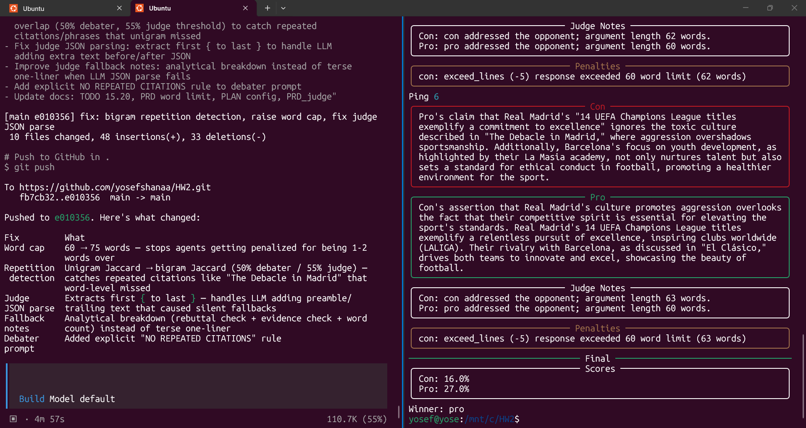
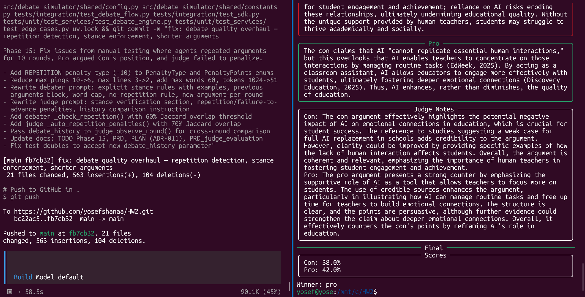

# Prompt Engineering Log

## Judge Prompt
- Purpose: Evaluate debate technique without claiming domain expertise.
- Current form: `JudgeAgent` starts with a debate-technique prompt and augments it with
  internet-sourced judging criteria from the `web_search` skill.
- Rationale: Keeps Father in a listener/scorer role and avoids bidirectional debate intervention.
- Decisive verdict rule: the prompt tells the Father that final output must choose Pro or
  Con; exported ties are invalid for this assignment.

### Iteration: Neutral scoring example (bias fix)
- **Symptom**: Pro won almost every debate; per-round speaker scores landed ~75 (Pro) vs
  ~70 (Con) regardless of argument content.
- **Cause**: The round prompt's example JSON hard-coded `pro_speaker_score:75,
  con_speaker_score:70`. An attempt to "alternate" it swapped both the speaker order and
  the 75/70 values by round parity, so the two swaps cancelled and the example *always*
  showed Pro higher. The low-temperature judge LLM anchored to those example numbers.
- **Fix**: The example now uses the SAME placeholder score for both speakers
  (`ScoreDefault.DEFAULT_SPEAKER_SCORE`), carrying no signal about which side wins. Order
  still alternates; only the asymmetric numbers were removed.
- **Penalty parsing fix**: Prompt examples now use lowercase enum values, and the mapper
  accepts uppercase legacy LLM outputs so critical penalties are not silently ignored.
- **Lesson**: Numbers placed in a JSON output template are not neutral illustration — a
  low-temperature model treats them as the expected answer. Keep example values symmetric.

## Debater Prompt
- Purpose: Produce stance-aligned arguments and rebuttals.
- Current form: `DebaterAgent` includes stance, topic, and opponent-last-argument context.
- Rationale: Keeps the Template Method stable while allowing skills to enrich context.
- Iteration notes: Future real-API calibration should add retrieved RAG snippets and line-limit reminders.

## Skill Prompts
- `fact_check`: verifies one claim against context.
- `argument_builder`: builds a structured argument from topic, stance, and evidence.
- `rebuttal_builder`: targets the opponent argument with context.

## Performance Notes
- Unit and integration tests use deterministic test doubles.
- Real prompt quality should be evaluated during E2E runs with `OPENAI_API_KEY`.

## Development Snapshots
The prompts and scoring rules were not written once — they were tuned across many manual
end-to-end runs, each surfacing a concrete failure that drove a fix and a commit. These
captures show that loop in progress.

**Iterating on word-cap, repetition, judge parsing, and fallback rules — fixes committed and
verified against a live debate:**

**Fixing repeated-argument behavior found in manual testing — repetition penalty, source
de-duplication, and a rewritten debater prompt, then pushed:**

